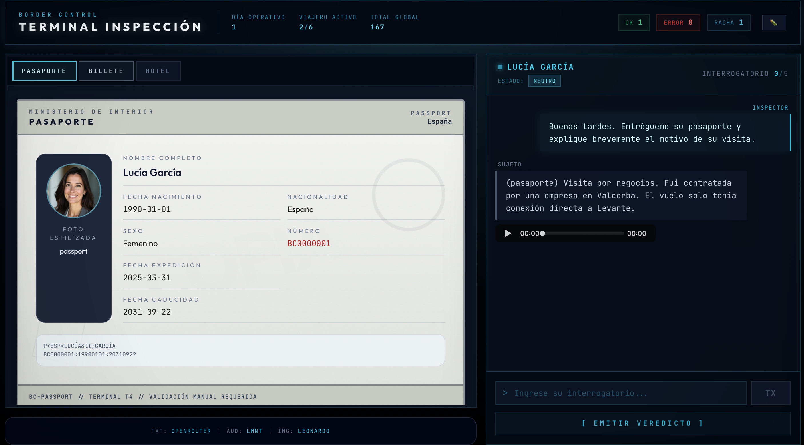
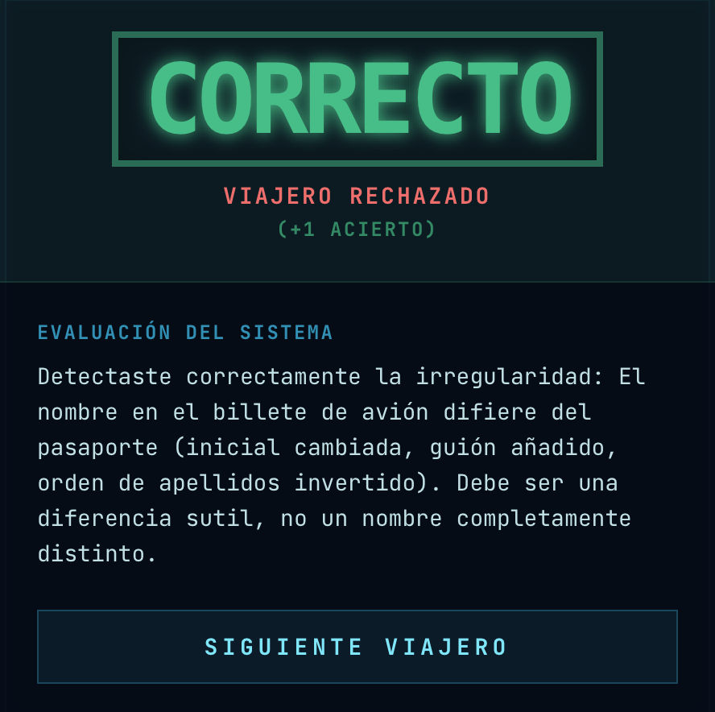

# 🛂 Border Control Game

A web-based border control simulation game inspired by _Papers, Please_, powered by Generative AI. And hosted in cubepath!

Step into the role of an immigration officer at the international airport. Your job is to inspect passports, ask the right questions, cross-reference travel documents with travelers' statements, and ultimately decide who gets to enter the country and whose entry gets rejected.



## ✨ Features

- **Dynamic AI-Generated Travelers**: Each traveler's profile, backstory, and set of documents are generated dynamically on the fly using Large Language Models. No two playthroughs are the same.
- **Interactive Interrogations**: Have real-time, free-form conversations with the travelers. Use your interrogation skills to find logical gaps or inconsistencies in their stories.
- **AI Portrait Generation**: Traveler faces are uniquely generated using AI image generation APIs like Freepik and Leonardo.
- **AI Voice Synthesis**: Hear the travelers speak with AI-generated text-to-speech provided by Fish Audio and LMNT.
- **Procedural Cases**: A built-in inconsistency system ensures a balanced mix of rule-abiding travelers and smugglers/liars, keeping the challenge fresh.



## 🛠️ Tech Stack

- **Framework**: [Next.js](https://nextjs.org/) (App Router, Turbopack)
- **UI Library**: [React 19](https://react.dev/)
- **Styling**: [Tailwind CSS v4](https://tailwindcss.com/)
- **Animations**: [Framer Motion](https://www.framer.com/motion/)
- **AI Integration**: [Vercel AI SDK](https://sdk.vercel.ai/)
- **Validation**: [Zod](https://zod.dev/)

## 🚀 Getting Started

### Prerequisites

Make sure you have Node.js (v18 or higher) installed on your machine.

### Installation

1.  **Clone the repository:**

    ```bash
    git clone https://github.com/your-username/border-control-game.git
    cd border-control-game
    ```

2.  **Install dependencies:**

    ```bash
    npm install
    ```

3.  **Environment Variables:**
    Copy the `.env.example` file to `.env` and fill in your API keys for the providers you wish to use.

    ```bash
    cp .env.example .env
    ```

    _Note: The game uses a fallback system. You don't need all API keys to play. If an image or audio provider is not configured or fails, the game will gracefully degrade to placeholders._

4.  **Run the development server:**

    ```bash
    npm run dev
    ```

5.  **Open the game:**
    Open [http://localhost:3000](http://localhost:3000) in your browser to start playing.

## ⚙️ Configuration

You can customize the AI providers and models used in the `.env` file:

- **LLM Providers**: Groq, OpenRouter, Cerebras, Vercel AI Gateway, or Local models.
- **Image Providers**: Freepik, Leonardo, Vercel.
- **Audio Providers**: Fish Audio, LMNT.

You can also enable/disable image and audio generation entirely through the `IMAGE_ENABLED` and `AUDIO_ENABLED` variables.
